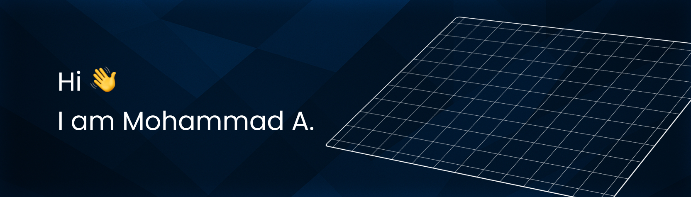

<<<<<<< HEAD

  

# React Portfolio Theme

A modern, customizable portfolio theme built with React and Chakra UI. Perfect for developers and designers looking to showcase their work with a clean, professional interface.

## Demo
- Personal Portfolio live demo: [Live demo](https://portfolio-opal-psi-28.vercel.app)

## Features

- 🎨 Modern UI with dark/light mode
- 📱 Fully responsive design
- 🖼️ Project showcase with modal views
- 🎯 Image gallery
- 🔧 Easy to customize
- ⚡ Performance optimized

## Quick Start

In the project directory, you can run:

### `npm start`

The app will run in development mode at [http://localhost:3000](http://localhost:3000)

## Customization

1. Replace static images in the `src/images` folder
2. Update project data in `Portfolio.js` and `Gallery.js`
3. Modify theme colors and styling through Chakra UI theme
4. Add your own content and sections as needed

## Available Scripts

- `npm start` - Runs the development server
- `npm test` - Launches the test runner
- `npm run build` - Builds for production
- `npm run eject` - Ejects from Create React App

## Connect With Me

- GitHub: [@Mohammad7Abubakar](https://github.com/Mohammad7Abubakar)
- LinkedIn: [Mohammad Abubakar](https://www.linkedin.com/in/mohammad-abubakar-099aa122a/)
- Personal Portfolio: [Mohammad Abubakar](https://portfolio-opal-psi-28.vercel.app)

## Learn More

- [Create React App documentation](https://facebook.github.io/create-react-app/docs/getting-started)
- [React documentation](https://reactjs.org/)

## License

This project is open source and available under the MIT License.

---

This project was bootstrapped with [Create React App](https://github.com/facebook/create-react-app).
=======
# portfolio-template-master
portfolio-template-master
>>>>>>> 12c8af7fe411d55385797b86ef696db0cf88b52f
